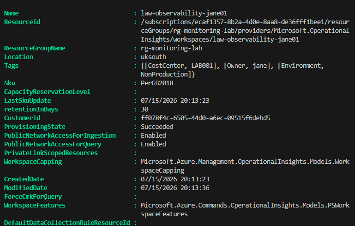
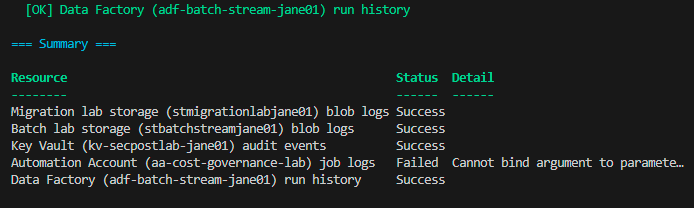
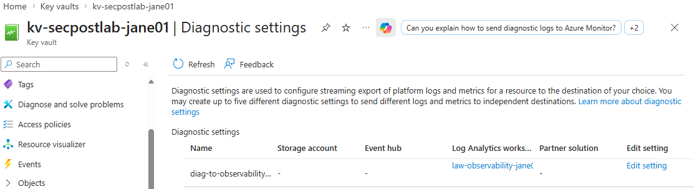
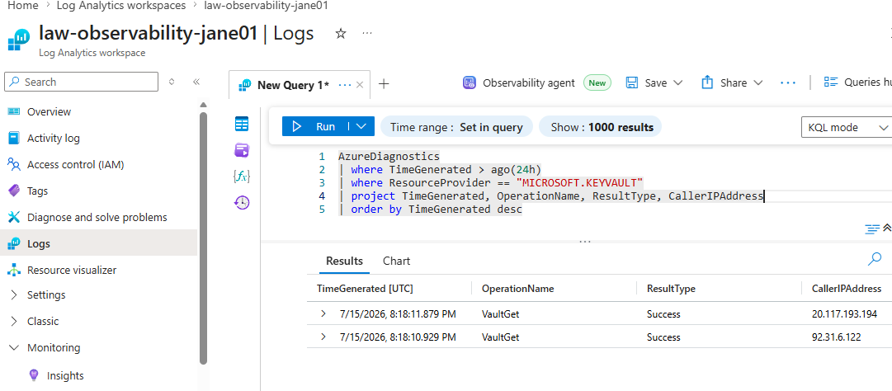
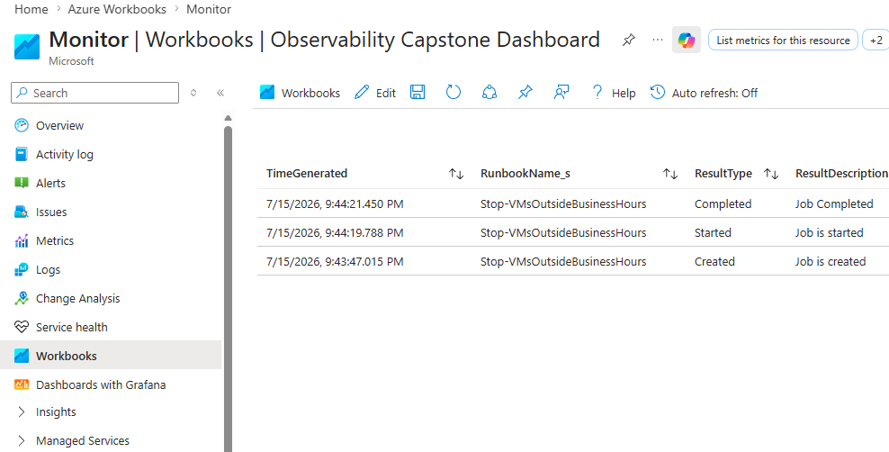

# Monitoring & Observability Capstone

**A unified Log Analytics workspace and Azure Monitor Workbook pulling
telemetry from resources across four earlier projects in this portfolio -
built entirely on free-tier Azure capabilities.**

Every project in this portfolio so far has been assessed one resource at a
time, in its own portal blade. That's not how a real environment gets
monitored day to day - a platform or operations team wants one place to ask
"what failed across my environment today," not five separate places. This
capstone builds that one place: a shared Log Analytics workspace collecting
diagnostic data from storage, Key Vault, Azure Automation, and Data Factory
resources already built earlier in this portfolio, queried through a small
library of KQL and visualised in a single Workbook.

## What This Deliberately Does Not Include

**Entra ID sign-in log export** is not part of this capstone. The identity
governance lab already established - and confirmed via direct testing, not
assumption - that exporting Entra sign-in logs to Log Analytics requires
P1/P2 licensing tenant-wide. Re-attempting that here would just hit the same
wall for the same reason. This capstone respects that earlier finding rather
than re-litigating it, and stays entirely within resource types whose
diagnostic logs are genuinely free to export at this lab's data volume.

## What's Included

| Component | Purpose |
|---|---|
| [`scripts/create-log-analytics-workspace.ps1`](scripts/create-log-analytics-workspace.ps1) | Creates the shared workspace all other resources send data to |
| [`scripts/enable-diagnostic-settings.ps1`](scripts/enable-diagnostic-settings.ps1) | Wires storage, Key Vault, Automation Account, and Data Factory into the shared workspace |
| [`kql-queries/`](kql-queries/) | A small library of KQL answering real operational questions across all connected resources |
| [`workbook/observability-workbook.json`](workbook/observability-workbook.json) | Azure Monitor Workbook combining several queries into one visual dashboard |
| [`docs/architecture.md`](docs/architecture.md) | Design rationale, table-naming realities, and cost model |
| [`docs/architecture-diagram.md`](docs/architecture-diagram.md) | Visual diagram of the data flow from source resources to dashboard |
| [`docs/setup-guide.md`](docs/setup-guide.md) | Full reproduction steps with screenshot evidence points |
| [`docs/screenshots/`](docs/screenshots/) | Evidence of the workspace, queries, and Workbook actually working |

## Resources Connected

| Source Resource | From Project | What It Contributes |
|---|---|---|
| `stmigrationlabjane01` (Storage) | Data Migration Lab | Blob read/write/delete operation logs |
| `stbatchstreamjane01` (Storage) | Batch & Streaming Lab | Blob read/write/delete operation logs |
| `kv-secpostlab-jane01` (Key Vault) | Security Posture Lab | Secret access audit events - the data-plane audit trail that project's Activity Log fallback couldn't show |
| `aa-cost-governance-lab` (Automation Account) | Cost Governance Lab | Runbook job execution logs |
| Data Factory (name varies) | Batch & Streaming Lab | Pipeline, activity, and trigger run history |

## Cost

- **Log Analytics workspace**: a genuine always-free monthly ingestion grant
  covers this lab's data volume comfortably - see [`docs/architecture.md`](docs/architecture.md) for
  the exact allowance
- **Diagnostic settings**: no charge for the setting itself, only for the
  data it sends (covered by the free grant above)
- **Azure Monitor Workbook**: free
- **Alert rules** (optional, documented separately): small per-rule cost,
  same honest caveat used elsewhere in this portfolio - not part of the
  guaranteed-free core scope

## Screenshots

Evidence of the shared workspace, diagnostic settings, live query results, and the final Workbook, captured against a live Azure subscription during this build. Files live in `docs/screenshots/`.

**1. Log Analytics Workspace Created**

The shared workspace provisioned, confirmed with `Sku: PerGB2018` (the tier that includes the always-free ingestion grant) and `ProvisioningState: Succeeded`.

**2. Diagnostic Settings Summary**

All five source resources wired into the shared workspace - including the Automation Account, fixed after discovering `Get-AzAutomationAccount` doesn't expose a `.ResourceId` property on this module version and building the resource ID manually instead.

**3. Diagnostic Setting Confirmed in Portal**

The Key Vault's diagnostic setting confirmed directly in its own portal blade - belt-and-braces evidence alongside the PowerShell verification, showing `AuditEvent` routed to the shared workspace.

**4. Live KQL Query Results**

Real Key Vault audit events, queried straight out of the shared workspace - proof the data pipeline works end to end, from resource to diagnostic setting to queryable log.

**5. Observability Workbook**

The finished dashboard showing Automation job history (Created -> Started -> Completed) pulled directly from the shared workspace, visualised outside any single resource's own portal blade.

## Setup Guide

Full steps: [`docs/setup-guide.md`](docs/setup-guide.md).

## Skills Demonstrated

- **Centralised observability design**: one workspace, multiple resource
  types, rather than checking each resource's own blade in isolation
- **KQL query authorship**: real operational questions expressed as queries,
  not just copy-pasted examples
- **Azure Monitor Workbooks**: combining multiple data sources into a single
  visual dashboard
- **Diagnostic settings across heterogeneous resource types**: understanding
  that log categories and destination table naming genuinely differ by
  resource type, and designing around that rather than assuming uniformity
- **Portfolio-level thinking**: treating five separate projects as parts of
  one environment worth monitoring together, not five unrelated exercises

## Conclusion

This capstone set out to prove something the other five projects in this
portfolio only implied: that they add up to a single, coherent environment
worth operating as one, not five disconnected exercises. That's genuinely
demonstrated here - a shared Log Analytics workspace pulling real telemetry
from storage, Key Vault, Azure Automation, and Data Factory resources built
across four earlier projects, queried through KQL that answers actual
operational questions, and visualised in a Workbook that didn't exist until
this project connected the dots.

The build also surfaced one more real platform quirk to add to this
portfolio's running list: `Get-AzAutomationAccount` doesn't expose a
`.ResourceId` property on the installed module version, requiring the
resource ID to be constructed manually from its component parts - the same
category of SDK/module inconsistency that's shown up repeatedly across this
body of work, each time diagnosed properly rather than worked around blindly.
That diagnostic discipline is, at this point, as much the point of this
portfolio as any individual Azure service.

Seven projects, seven different angles - identity, cost, migration, data
pipelines, backup and recovery, security posture and secrets, and now
observability tying the other six together - all built on a genuinely free
Azure subscription, all documented with the real obstacles included rather
than edited out. That's the portfolio.

## Author

Jane - Cloud & Infrastructure Engineer, AZ-104 candidate.
Capstone project drawing on the Cloud Cost Governance, On-Premise to Cloud
Data Migration, Batch & Streaming Pipeline, and Cloud Security Posture &
Secrets Management labs.