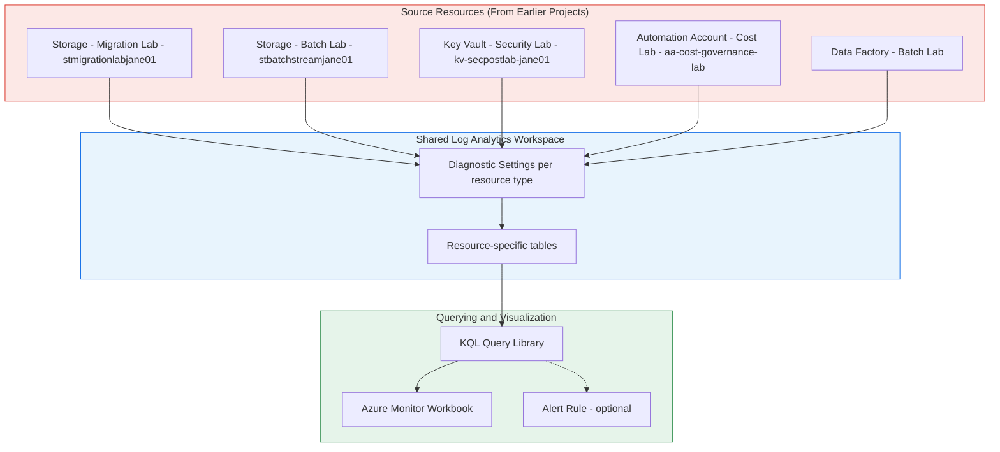

# Architecture Diagram

## Reading This Diagram

**Sources (top, red):** five resources spanning four earlier projects,
deliberately not new infrastructure built just to have something to
monitor.

**Workspace (middle, blue):** the single point of convergence.

**Consumption (bottom, green):** the actual value this creates - queries
answering real operational questions, a Workbook making that visual and
persistent, and an alert rule turning it proactive.